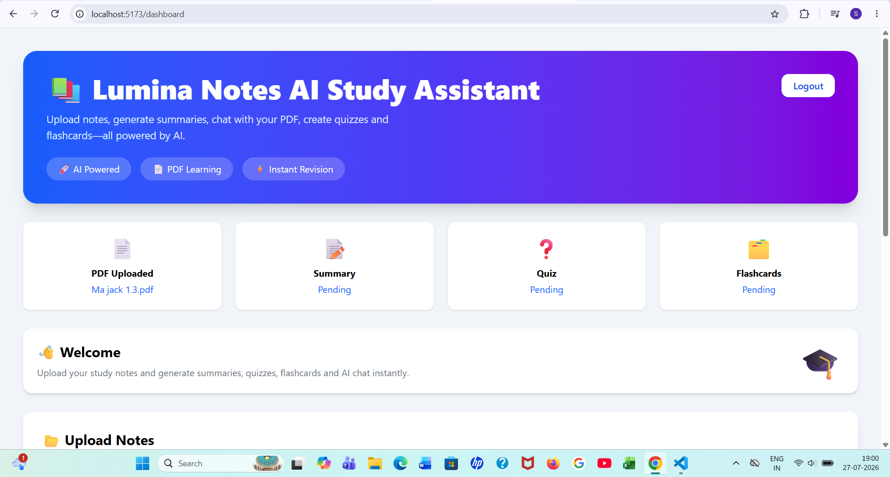
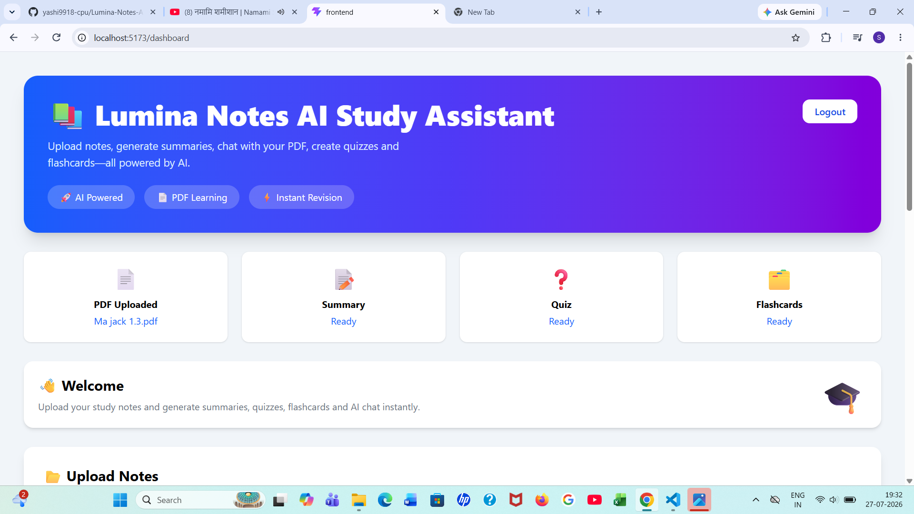
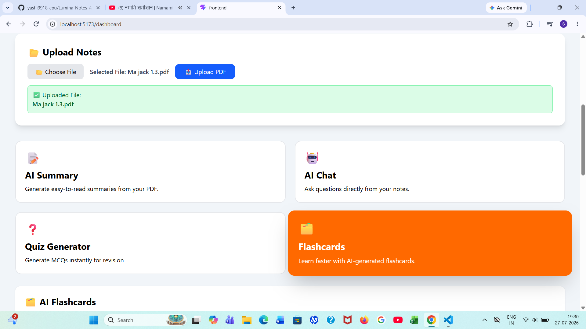
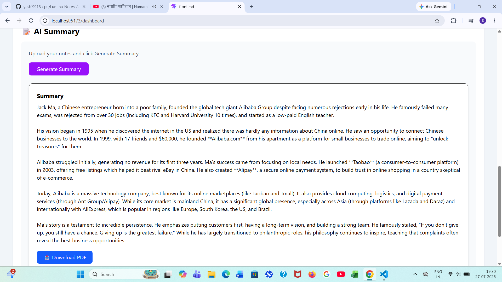
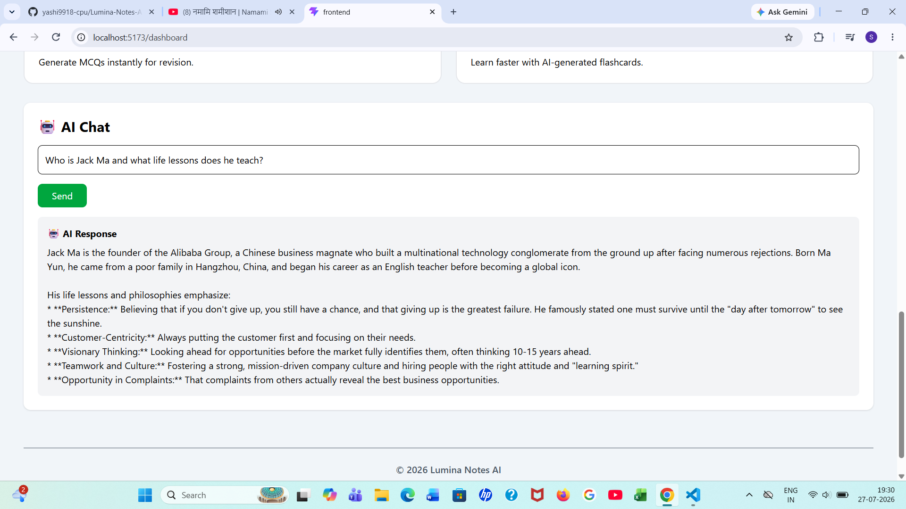
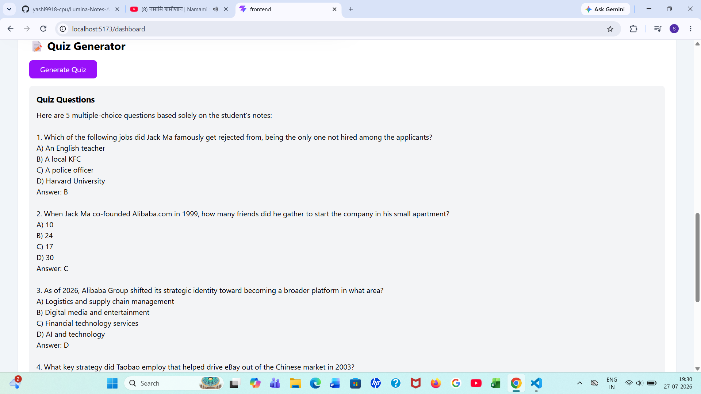
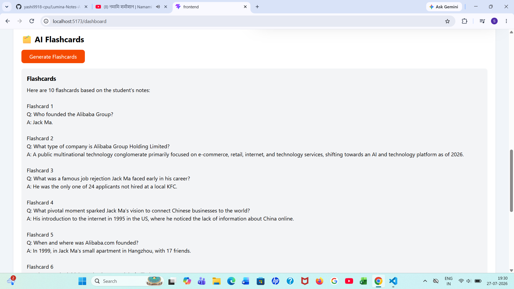

# 📚 Lumina Notes AI

<p align="center">


</p>

An AI-powered study assistant that helps students learn smarter from their own notes.

---

# 🌐 Live Demo

### 🚀 Try it Live

**Live Demo:** https://lumina-notes-ai.vercel.app/dashboard

### 🔗 Backend API

**https://lumina-notes-ai-backend.onrender.com**

---

# ✨ Features

- 📄 Upload PDF Notes
- 🤖 AI Summary Generator
- 💬 Chat with PDF Notes using AI
- 📝 AI Quiz Generator
- 🧠 AI Flashcards Generator
- 📥 Download Summary as PDF
- 📱 Responsive UI
- ⚡ Fast React + Vite Frontend

---

# 🛠 Tech Stack

## Frontend

- React.js
- Vite
- Tailwind CSS
- Axios
- jsPDF

## Backend

- Node.js
- Express.js
- Multer
- PDF-Parse
- CORS

## AI

- Google Gemini API

## Deployment

- Vercel (Frontend)
- Render (Backend)

---

# 📂 Project Structure

```text
Lumina-Notes-AI
│
├── frontend
│
├── backend
│
└── screenshots
```

---

# 🚀 Installation

## Clone Repository

```bash
git clone https://github.com/yashi9918-cpu/Lumina-Notes-AI.git
```

## Backend

```bash
cd backend
npm install
npm start
```

## Frontend

```bash
cd frontend
npm install
npm run dev
```

---

# 🔑 Environment Variables

Create a `.env` file inside the backend folder.

```env
GEMINI_API_KEY=YOUR_GEMINI_API_KEY
```

---

# 📸 Screenshots

## 🏠 Dashboard



---

## 📊 Dashboard Statistics



---

## 📄 Upload Notes



---

## 🤖 AI Summary



---

## 💬 AI Chat



---

## 📝 Quiz Generator



---

## 🧠 Flashcards



---

# 🌟 Future Improvements

- 🔐 User Authentication
- 🎙 Voice Assistant
- 📈 Study Progress Tracker
- 🧠 AI Revision Planner
- ☁ Cloud Storage

---

# 👩‍💻 Developer

## Siya Singh

**CSE (AI & ML) Student**

Passionate about Artificial Intelligence, Web Development, and building practical AI applications.

---

## ⭐ Support

If you like this project, consider giving it a **⭐ Star** on GitHub.
